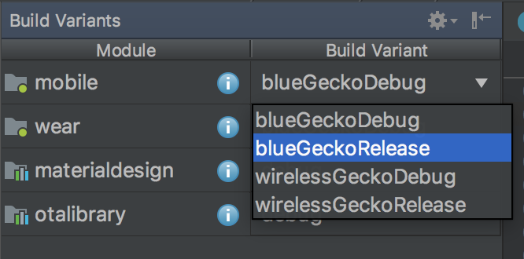

# Wireless Gecko for Android

This is the source code of the SiliconLabs/Wireless Gecko Application for Android.
## Description
The Silicon Labs Wireless Gecko app enables interaction with Wireless Gecko SoCs and Modules. The main component is a connected lighting demo featuring Silicon Labs' dynamic multiprotocol software, enabling simultaneous operation of Bluetooth + Zigbee or Bluetooth + Proprietary (2.4 GHz or Sub-GHz) on a single, multiprotocol wireless SoC. Required hardware:

- Dynamic Multiprotocol (Bluetooth + Zigbee)
EFR32 Mighty Gecko Wireless Starter Kit (SLWSTK6000B) available for purchase here: [https://www.silabs.com/products/development-tools/wireless/mesh-networking/mighty-gecko-starter-kit](https://www.silabs.com/products/development-tools/wireless/mesh-networking/mighty-gecko-starter-kit)

- Dynamic MultiprotocolBluetooth + Sub-GHz))
  - 1 x EFR32 Flex Gecko Dual Band Starter Kits available for purchase here: [https://www.silabs.com/products/development-tools/wireless/proprietary#flex](https://www.silabs.com/products/development-tools/wireless/proprietary#flex)
  - plus 2 x EFR32 Mighty Gecko Dual Band Radio Boards available for purchase here: [https://www.silabs.com/products/development-tools/wireless/wireless-radio-boards#zigbee](https://www.silabs.com/products/development-tools/wireless/wireless-radio-boards#zigbee)

As Wireless Gecko app and Blue Gecko app share part of the same source code, to build then separately is necessary to choose the Build Variant in the bottom left corner of Android Studio:

Additional information on the supporting hardware and other projects may be found within the [Silabs.com](https://github.com/SiliconLabs).

