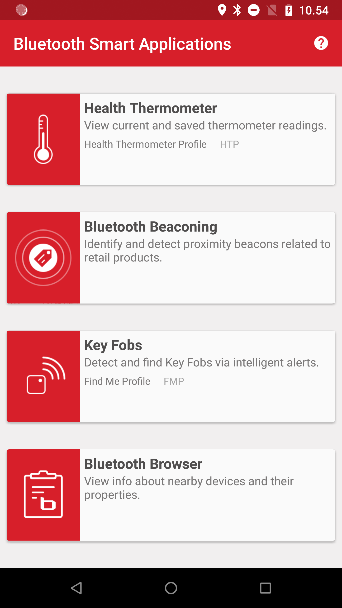
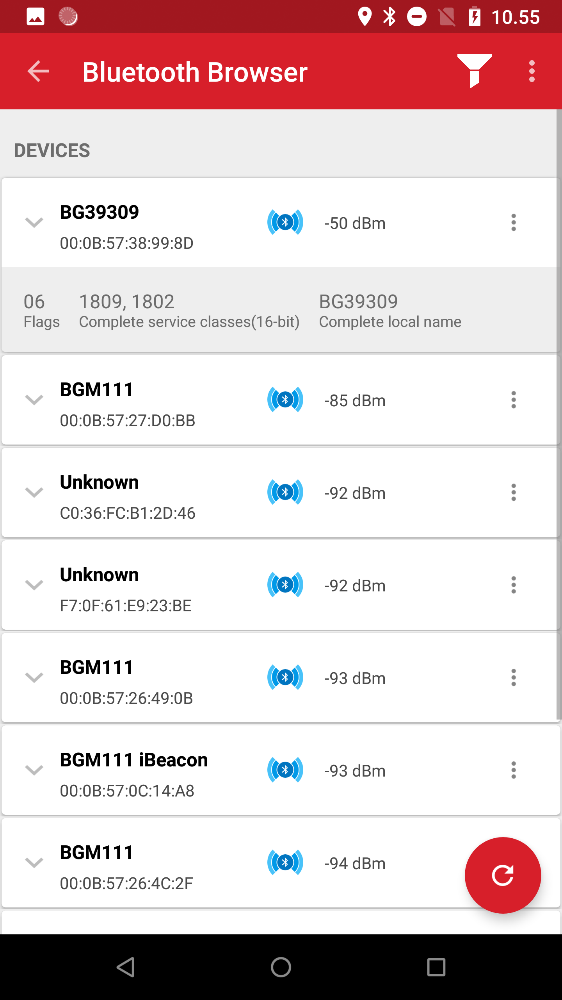
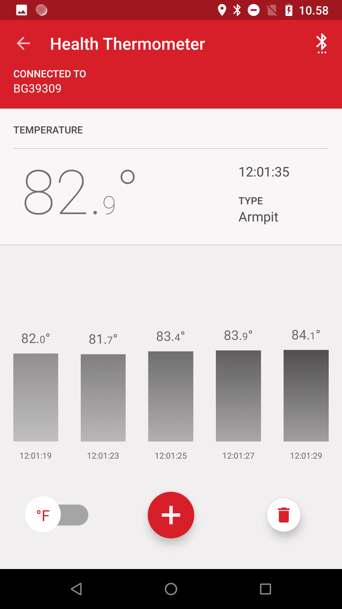
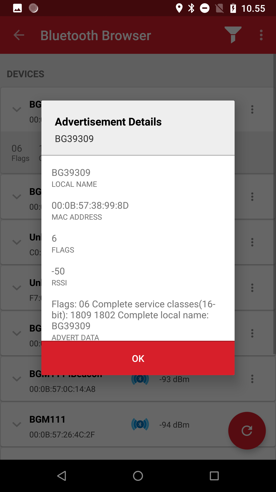

# Silicon Labs Blue Gecko app for Android 
This is the source code for the SiliconLabs/Blue Gecko Application for Android.

## Additional Information
The Silicon Labs Blue Gecko App utilizes the Bluetooth adapter on your phone/tablet to scan for and connect to BLE devices.
The main components include: Health Thermometer, Retail Beacon, Key Fob, and BLE Stack & Profile Test.
The app can display temperature measurements from the Silicon Labs Bluetooth Smart Wireless Starter Kit (SLWSK).
The app can also indicate proximity to the SLWSTK using Find Me Profile (FMP) & Proximity Profiles (PXP) or a Beacon Profile.
The Retail Beacon component displays relevant information for AltBeacons, Eddystone Beacons, and iBeacons.
The BLE Stack & Profile Test component uses an unfiltered discovery process to pick up on the advertisement data of nearby Bluetooth devices.
This component of the app can also connect to Bluetooth devices in order to show available services, and read/write values of characteristics.

Key Features:
- Scan for bluetooth low energy peripherals
- Beaconing
- Thermometer and Keyfob
- Get common info (UUID, RSSI, ADVERTISEMENT DATA)
- Write and Read Characteristics and Services
- Register Indications and Notifications 

Additional information on the supporting hardware and other projects may be found within the [silabs.com](http://silabs.com/).

